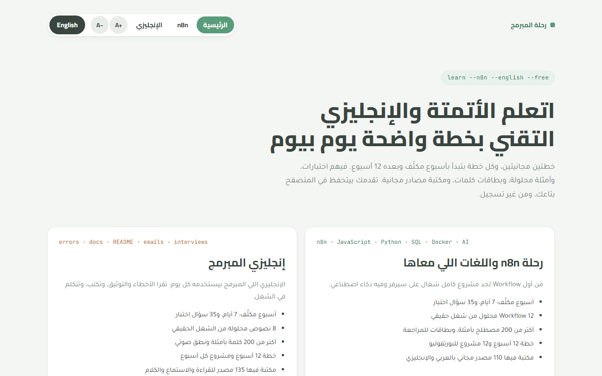
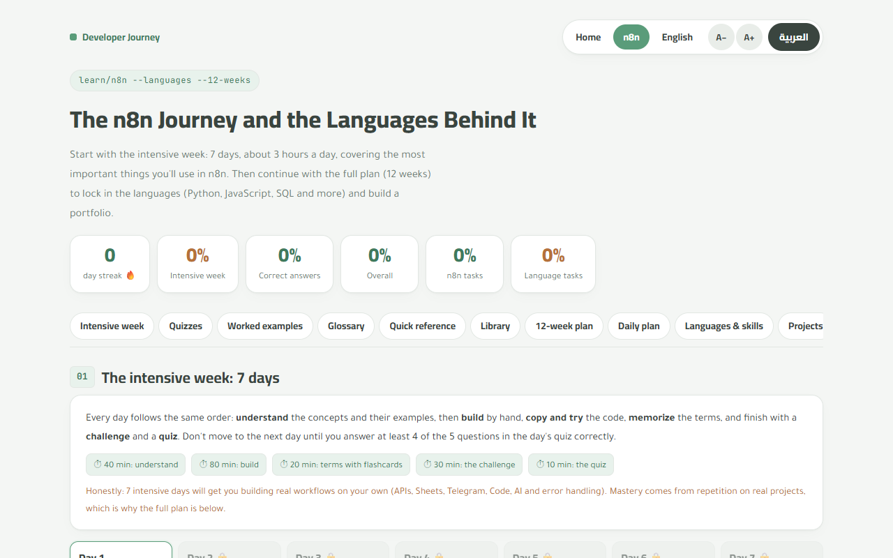
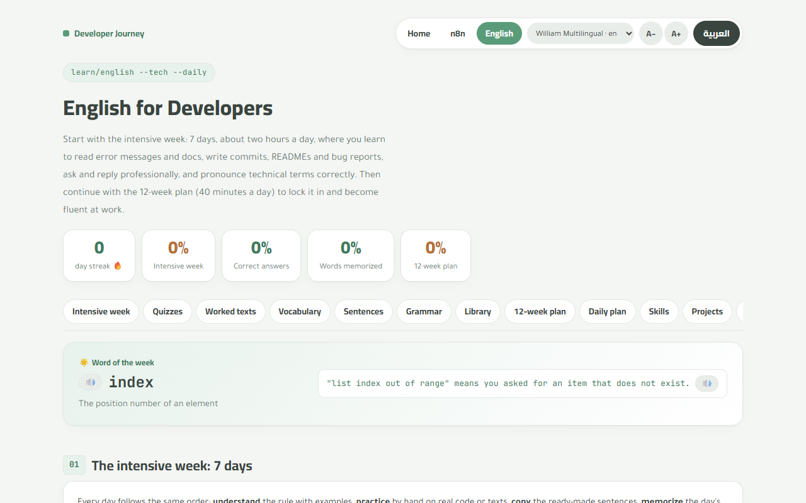

<div align="center">


# Developer Journey · رحلة المبرمج

**Learn n8n automation and technical English with a clear day-by-day plan — free, bilingual, in your browser.**

[](https://micro4tricks-ai.github.io/learn-n8n-english/)
&nbsp;

&nbsp;


[](https://micro4tricks-ai.github.io/learn-n8n-english/)

<a href="https://micro4tricks-ai.github.io/learn-n8n-english/"></a>

[**Open the site**](https://micro4tricks-ai.github.io/learn-n8n-english/) · [n8n plan](https://micro4tricks-ai.github.io/learn-n8n-english/n8n.html) · [English plan](https://micro4tricks-ai.github.io/learn-n8n-english/english.html) · [Report a problem](https://github.com/micro4tricks-ai/learn-n8n-english/issues/new/choose)

</div>

---

## Contents

- [About](#about)
- [What's inside](#whats-inside)
- [The n8n Journey](#the-n8n-journey)
- [English for Developers](#english-for-developers)
- [Screenshots](#screenshots)
- [Features](#features)
- [Tech stack](#tech-stack)
- [Getting started](#getting-started)
- [Project structure](#project-structure)
- [How translation works](#how-translation-works)
- [Deploy](#deploy)
- [Contributing](#contributing)
- [Privacy](#privacy)
- [Content and credits](#content-and-credits)
- [License](#license)

## About

Two free learning plans in one site, for Arabic-speaking developers who want to **automate real work with n8n** and **work confidently in English**:

| Plan | For | Starts with | Then |
|---|---|---|---|
| ⚙️ **The n8n Journey** — `n8n.html` | Building automations with n8n plus the languages around it: JavaScript, Python, JSON/HTTP, SQL, Regex, Git, Docker and AI | 7 intensive days, ~3 h/day | A 12-week plan with a weekly project |
| 📘 **English for Developers** — `english.html` | The English you use every day at work: error messages, docs, READMEs, commits, emails, meetings and interviews | 7 intensive days, ~2 h/day | A 12-week plan, ~40 min/day |

<div dir="rtl">

**بالعربي:** خطتان مجانيتان في موقع واحد: «رحلة n8n» لبناء الأتمتة ومعها JavaScript وPython وSQL وDocker والذكاء الاصطناعي، و«إنجليزي المبرمج» للإنجليزية التي يستخدمها المبرمج كل يوم. كل خطة تبدأ بأسبوع مكثّف فيه شرح وتمارين واختبار لكل يوم، ثم خطة 12 أسبوعاً بمشروع أسبوعي. الموقع كله يتحوّل بين العربية والإنجليزية بضغطة زر، ويحفظ تقدّمك في متصفحك دون تسجيل.

</div>

## What's inside

<table>
  <tr>
    <th align="left">⚙️ n8n Journey</th><th align="right">Count</th>
    <th align="left">📘 English for Developers</th><th align="right">Count</th>
  </tr>
  <tr><td>Intensive days (lesson, build, code, challenge, quiz)</td><td align="right">7</td><td>Intensive days</td><td align="right">7</td></tr>
  <tr><td>Quiz questions in the intensive week</td><td align="right">35</td><td>Quiz questions in the intensive week</td><td align="right">35</td></tr>
  <tr><td>Weeks in the full plan</td><td align="right">12</td><td>Weeks in the full plan</td><td align="right">12</td></tr>
  <tr><td>Worked, real-world workflows</td><td align="right">12</td><td>Worked texts (errors, docs, emails…)</td><td align="right">8</td></tr>
  <tr><td>Glossary terms with examples</td><td align="right">203</td><td>Vocabulary words with audio</td><td align="right">286</td></tr>
  <tr><td>Quick-reference cheat sheets</td><td align="right">12</td><td>Ready-made sentences</td><td align="right">36</td></tr>
  <tr><td>Common errors explained</td><td align="right">34</td><td>Error messages explained</td><td align="right">16</td></tr>
  <tr><td>Language &amp; skill tracks</td><td align="right">11</td><td>Grammar rules (right vs. wrong)</td><td align="right">12</td></tr>
  <tr><td>Weekly projects + capstone steps</td><td align="right">12 + 7</td><td>Skill tracks + capstone steps</td><td align="right">6 + 6</td></tr>
  <tr><td>Free library resources</td><td align="right">110</td><td>Free library resources</td><td align="right">135</td></tr>
</table>

## The n8n Journey

### The intensive week

| Day | Focus |
|:-:|---|
| 1 | The n8n mindset: items, JSON and expressions |
| 2 | APIs and HTTP, plus logic with IF, Switch and Merge |
| 3 | Connecting services: Google Sheets, Telegram, Gmail and scheduling |
| 4 | Transforming data: the Code node, dates and built-in functions |
| 5 | Control and reliability: loops, sub-workflows and error handling |
| 6 | AI in n8n: chains, agents and data extraction |
| 7 | Going to production and the capstone project |

Each day unlocks after you answer at least 4 of its 5 quiz questions correctly.

### The 12-week plan

| Week | Theme | Week | Theme |
|:-:|---|:-:|---|
| 1 | Running n8n and the basics | 7 | Files and scraping the web |
| 2 | Data and APIs | 8 | Databases and SQL |
| 3 | Connecting services + first Python | 9 | Errors and reliability |
| 4 | Real APIs + Python for data | 10 | Running n8n 24/7 |
| 5 | The Code node + JavaScript basics | 11 | Connecting Python and AI to n8n |
| 6 | Data processing + Regex | 12 | The capstone, ready for work |

**Worked workflows** include a lead form with instant alerts, a daily weather/news report, a small API with a webhook and validation, overdue-invoice reminders, contact de-duplication, an AI news digest on Telegram, an AI support bot, invoice data extraction from email, a central error workflow, paginated API sync to a database, human approval before execution, and workflow backups to GitHub.

**Tracks:** JavaScript · JSON, HTTP and cURL · Python · Git and GitHub · SQL · Terminal (PowerShell/Bash) and SSH · Docker and YAML · Regex · HTML and CSS selectors · Markdown and READMEs · Prompting and AI.

## English for Developers

| Day | Focus |
|:-:|---|
| 1 | Reading error messages and tracebacks |
| 2 | Reading documentation |
| 3 | The language of code: names, comments and docstrings |
| 4 | Writing commits, READMEs and bug reports |
| 5 | Communicating: asking, requesting and replying to a client |
| 6 | Listening and pronunciation: terms and symbols |
| 7 | Presenting your work: interviews and your portfolio |

The 12-week plan then covers reading, listening, writing and speaking every week, with a grammar point and a small project for each.

## Screenshots

<table>
  <tr>
    <td width="50%"><p align="center"><sub>The n8n plan (English)</sub></p></td>
    <td width="50%"><p align="center"><sub>English for Developers (English)</sub></p></td>
  </tr>
</table>

## Features

- 🌐 **Arabic ⇄ English on every page** — the UI, lessons, tasks, quizzes and vocabulary all switch language and direction (RTL ↔ LTR). The choice is remembered.
- 📅 **Day-by-day flow** — intensive days unlock in order, and finished sections collapse so you only see what's next.
- ✅ **Progress tracking** — streaks, quiz scores and task completion, saved in your browser.
- 🃏 **Flashcards** with a "Got it" pile, search, and audio pronunciation with a stop button.
- 🔠 **Adjustable text size** (A− / A+) in the header.
- 📚 **Library** of free official docs and books, each with what to read and when.
- 🪶 **Lightweight** — plain HTML, CSS and JavaScript. No framework, no build step, works on any static host.

## Tech stack

| Layer | Used |
|---|---|
| Pages | HTML5, CSS3 (logical RTL/LTR styles through `html[dir]`) |
| Logic | Vanilla JavaScript, no framework |
| Audio | Browser speech synthesis (Web Speech API) |
| Storage | `localStorage` |
| Tooling | Node.js scripts with `jsdom` and `acorn` for string extraction and smoke tests |
| Hosting | GitHub Pages |

## Getting started

Use it online at **https://micro4tricks-ai.github.io/learn-n8n-english/**, or run it locally with any static server:

```bash
git clone https://github.com/micro4tricks-ai/learn-n8n-english.git
cd learn-n8n-english
python -m http.server 8000      # or: npm run serve
# open http://localhost:8000
```

Opening `index.html` straight from disk also works, but each page then keeps its own saved progress per file.

## Project structure

```
index.html            Landing page
n8n.html              The n8n plan
english.html          The English plan
assets/
  css/site.css        Shared styles (RTL/LTR via html[dir])
  js/i18n.js          Language switch + T()/TF()/TDEEP() helpers
  js/ui.js            Shared UI: font size, audio, day-by-day reveal
  js/*-data.js        Page content (Arabic source text)
  js/*-app.js         Page logic and rendering
  js/*-en.js          English dictionaries (generated — see below)
  logo.svg, favicon.svg
docs/                 Screenshots and social preview
tools/                Translation and test scripts (Node.js)
  i18n/<page>-keys.json   Arabic source strings, in a fixed order
  i18n/<page>-NN.json     English translations, by index
```

## How translation works

Arabic is the source language. Every string in the data, the page HTML and the app code is Arabic, and `assets/js/<page>-en.js` maps each Arabic string to English.

- In code, UI text goes through `T('…')`, templates through `TF('… {n} …', {n: 3})`, and data through `TDEEP(data)`.
- Static HTML is translated on load; an element with `data-t` is translated as one unit (for text mixed with `<b>`, `<code>`, …).

After you add or change Arabic text:

```bash
npm install                 # once: jsdom + acorn for the tools
npm run i18n:missing        # lists untranslated strings → tools/missing-<page>.json
npm run i18n:build          # appends them to tools/i18n/<page>-keys.json and rebuilds the dictionaries
```

Add the English text for the new indexes in a new `tools/i18n/<page>-NN.json` file, run `npm run i18n:build` again, then:

```bash
npm test                    # renders every page in both languages and reports errors or leftover Arabic
```

Local CSS and JS are loaded with a `?v=YYYYMMDD` query for cache-busting — bump it on every release.

## Deploy

The site is static, so upload the files as they are:

- **GitHub Pages:** Settings → Pages → Deploy from branch → `main` / root. (This is how the live site is served.)
- **Netlify / Cloudflare Pages:** connect the repo, no build command, publish directory `/`.
- **Hostinger / any cPanel host:** upload everything except `tools/`, `node_modules/` and `package*.json` into `public_html/`.

Progress is stored per domain, so moving the site to a new domain starts learners from zero.

## Contributing

Suggestions, corrections and new free resources are welcome.

1. [Open an issue](https://github.com/micro4tricks-ai/learn-n8n-english/issues/new/choose) to report a mistake or propose content.
2. For code changes: fork the repo, create a branch, make your change, run `npm test`, and open a pull request.
3. New text must be written in Arabic first and translated with the steps in [How translation works](#how-translation-works).
4. Only link to free or official resources — never copy book content into the repo.

## Privacy

No accounts, no analytics, no cookies, no server. Everything you do is saved in your own browser's `localStorage` and never leaves your device. Clearing your browser data resets your progress.

## Content and credits

All external resources are links to their official websites or to books their authors publish for free. No third-party book content is copied into this repository. n8n is a trademark of n8n GmbH; this project is an independent learning resource and is not affiliated with n8n.

## License

The code is released under the [MIT License](LICENSE). Linked resources keep their own licenses.

---

<div align="center">

Designed and built by **Mahmoud Habashi · محمود حبشي** — [micro4tricks@gmail.com](mailto:micro4tricks@gmail.com)

If this helps you, ⭐ star the repo so more learners can find it.

</div>
