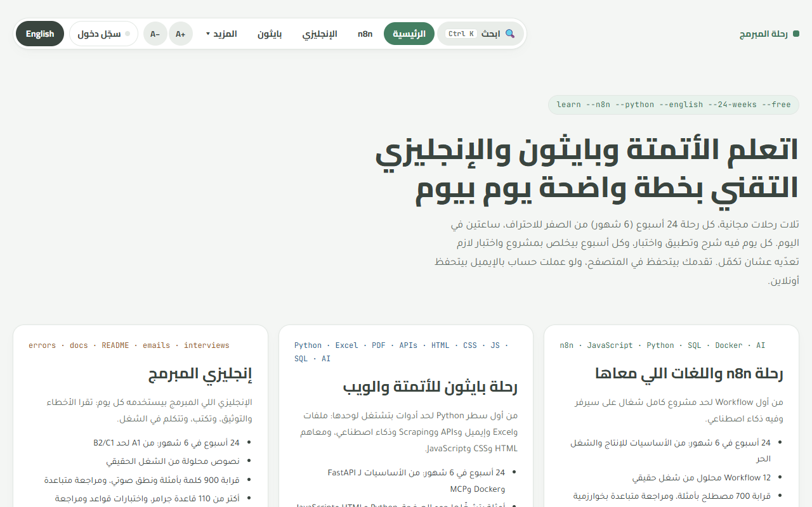
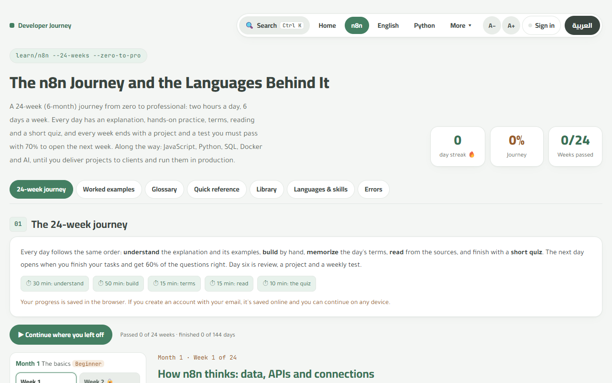
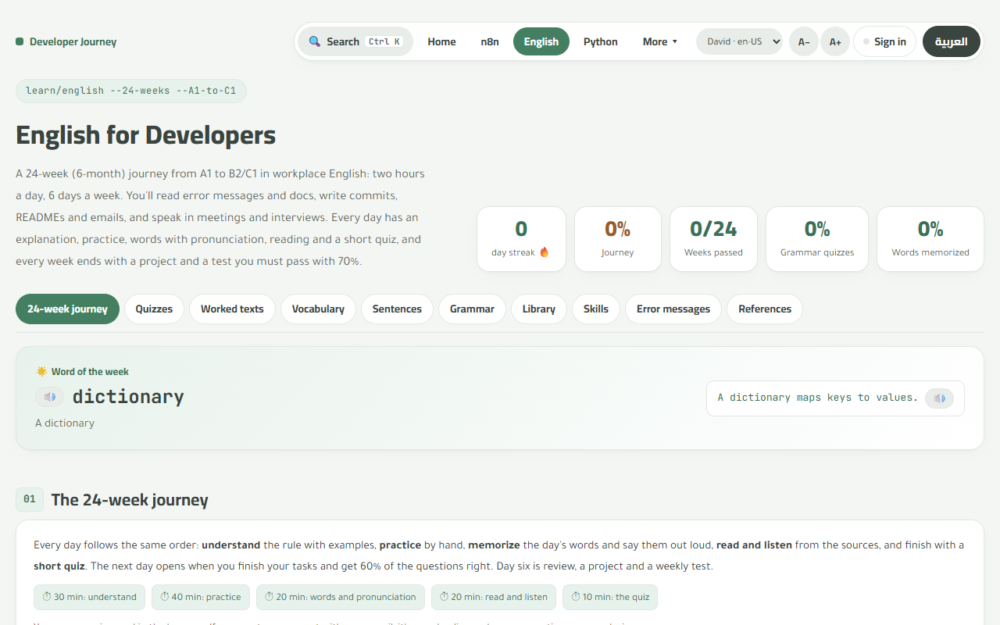
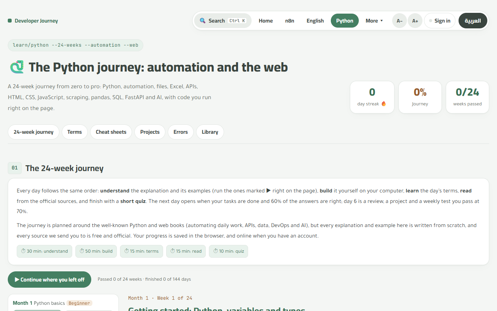

<div align="center">


# Developer Journey · رحلة المبرمج

**Learn n8n automation, Python for automation and the web, and technical English with a clear day-by-day plan — free, bilingual, in your browser.**

[](https://micro4tricks-ai.github.io/learn-n8n-english/)
&nbsp;

&nbsp;


[](https://micro4tricks-ai.github.io/learn-n8n-english/)

<a href="https://micro4tricks-ai.github.io/learn-n8n-english/"></a>

[**Open the site**](https://micro4tricks-ai.github.io/learn-n8n-english/) · [n8n plan](https://micro4tricks-ai.github.io/learn-n8n-english/n8n.html) · [Python plan](https://micro4tricks-ai.github.io/learn-n8n-english/python.html) · [English plan](https://micro4tricks-ai.github.io/learn-n8n-english/english.html) · [Review](https://micro4tricks-ai.github.io/learn-n8n-english/review.html) · [Lab](https://micro4tricks-ai.github.io/learn-n8n-english/lab.html) · [Prompts](https://micro4tricks-ai.github.io/learn-n8n-english/prompts.html) · [Report a problem](https://github.com/micro4tricks-ai/learn-n8n-english/issues/new/choose)

</div>

---

## Contents

- [About](#about)
- [What's inside](#whats-inside)
- [The n8n Journey](#the-n8n-journey)
- [The Python Journey](#the-python-journey)
- [English for Developers](#english-for-developers)
- [The tools](#the-tools)
- [Screenshots](#screenshots)
- [Features](#features)
- [Tech stack](#tech-stack)
- [Getting started](#getting-started)
- [Project structure](#project-structure)
- [How translation works](#how-translation-works)
- [Common commands](#common-commands)
- [Deploy](#deploy)
- [Contributing](#contributing)
- [Privacy](#privacy)
- [Content and credits](#content-and-credits)
- [License](#license)

## About

Three free 24-week journeys in one site, for Arabic-speaking developers who want to **automate real work with n8n**, **write the Python behind it** and **work confidently in English**:

| Journey | For | Length | Pace |
|---|---|---|---|
| ⚙️ **The n8n Journey** — `n8n.html` | Building automations with n8n plus the languages around it: JavaScript, Python, JSON/HTTP, SQL, Regex, Git, Docker and AI — up to client work in production | 24 weeks (6 months) | 2 h/day, 6 days a week |
| 🐍 **The Python Journey** — `python.html` | Python for automation from the first line: files, Excel, PDF, email, APIs, scraping, SQL, pandas, FastAPI, LLMs and MCP — plus the HTML, CSS and JavaScript around it. Examples run on the page | 24 weeks (6 months) | 2 h/day, 6 days a week |
| 📘 **English for Developers** — `english.html` | The English you use every day at work: error messages, docs, READMEs, commits, emails, meetings and interviews — from A1 to B2/C1 | 24 weeks (6 months) | 2 h/day, 6 days a week |

Every week has five study days (explanation → hands-on practice → words/terms → reading → short quiz) and a sixth day with a review, a weekly project and a **weekly test**: the next week opens at **70%**. Monthly exams and a final exam with a capstone project close each month and the journey.

> **Status:** all 24 weeks of the three journeys are written (432 study days), with 5 monthly exams and a final exam per journey and a printable completion certificate. See the [student guide](docs/STUDENT_GUIDE.md) and the [design](docs/superpowers/specs/2026-09-28-24-week-program-design.md).

<div dir="rtl">

**بالعربي:** ثلاث رحلات مجانية في موقع واحد، كل رحلة 24 أسبوعاً (6 أشهر) بساعتين في اليوم: «رحلة n8n» لبناء الأتمتة ومعها JavaScript وPython وSQL وDocker والذكاء الاصطناعي حتى العمل مع العملاء، و«رحلة بايثون» للأتمتة والويب من أول سطر حتى FastAPI وDocker وMCP ومعها HTML وCSS وJavaScript وأمثلة تعمل داخل الصفحة، و«إنجليزي المبرمج» من A1 إلى B2/C1 في إنجليزية العمل. كل أسبوع خمسة أيام مذاكرة ويوم مراجعة ومشروع واختبار، والأسبوع التالي يُفتح عند 70%. التقدّم يُحفظ في المتصفح، ويمكن إنشاء حساب بالبريد الإلكتروني لحفظه أونلاين.

</div>

## What's inside

<table>
  <tr>
    <th align="left">⚙️ n8n Journey</th><th align="right">Count</th>
    <th align="left">📘 English for Developers</th><th align="right">Count</th>
  </tr>
  <tr><td>Weeks / study days</td><td align="right">24 / 144</td><td>Weeks / study days</td><td align="right">24 / 144</td></tr>
  <tr><td>Lessons with examples</td><td align="right">375</td><td>Lessons with examples</td><td align="right">390</td></tr>
  <tr><td>Hands-on practice tasks</td><td align="right">495</td><td>Hands-on practice tasks</td><td align="right">490</td></tr>
  <tr><td>Daily quiz + weekly test questions</td><td align="right">360 + 286</td><td>Daily quiz + weekly test questions</td><td align="right">360 + 294</td></tr>
  <tr><td>Terms taught in the journey</td><td align="right">672</td><td>Vocabulary words taught (all with audio)</td><td align="right">887</td></tr>
  <tr><td>Monthly exams + final exam</td><td align="right">5 + 1</td><td>Monthly exams + final exam</td><td align="right">5 + 1</td></tr>
  <tr><td>Worked, real-world workflows</td><td align="right">12</td><td>Grammar rules (right vs. wrong)</td><td align="right">117</td></tr>
  <tr><td>Common errors explained</td><td align="right">34</td><td>Error messages and HTTP codes explained</td><td align="right">49</td></tr>
  <tr><td>Free library resources (with filters)</td><td align="right">301</td><td>Free library resources (with filters)</td><td align="right">290</td></tr>
</table>

<table>
  <tr><th align="left">🐍 Python Journey</th><th align="right">Count</th></tr>
  <tr><td>Weeks / study days</td><td align="right">24 / 144</td></tr>
  <tr><td>Lessons with examples (256 run on the page: Python, HTML, JavaScript)</td><td align="right">360</td></tr>
  <tr><td>Hands-on practice tasks</td><td align="right">480</td></tr>
  <tr><td>Daily quiz + weekly test questions</td><td align="right">362 + 288</td></tr>
  <tr><td>Terms taught in the journey</td><td align="right">761</td></tr>
  <tr><td>Monthly exams + final exam</td><td align="right">5 + 1</td></tr>
  <tr><td>Automation projects / cheat sheets / common errors</td><td align="right">10 / 9 / 28</td></tr>
  <tr><td>Free library resources (books, courses, docs)</td><td align="right">117</td></tr>
</table>

## The n8n Journey

| Month | Weeks | Topic | Languages and tools |
|:-:|:-:|---|---|
| 1 | 1–4 | The basics: running n8n, items, expressions, triggers, JSON and HTTP | Terminal, Git, JSON |
| 2 | 5–8 | Integrations and data: Sheets, Gmail, Telegram, APIs and auth, webhooks, transformation | JavaScript basics, cURL |
| 3 | 9–12 | Code and logic: the Code node, Regex, branching/merging/looping, errors, sub-workflows | JavaScript, Python basics |
| 4 | 13–16 | Data systems: SQL and Postgres, files, scraping, scheduling, pagination | SQL, Python, HTML |
| 5 | 17–20 | AI: LLMs, prompts, agents and tools, RAG and vector stores, MCP | Prompting, embeddings |
| 6 | 21–24 | Production and career: Docker and a VPS, security, queue mode and monitoring, custom nodes, freelancing, capstone | Docker, Linux, YAML |

Also on the page: **worked workflows** from real work, a glossary with flashcards, quick-reference cheat sheets, common errors explained, language tracks and a library of free resources.

## The Python Journey

| Month | Weeks | Topic | Covers |
|:-:|:-:|---|---|
| 1 | 1–4 | Python basics | Running Python, strings and numbers, conditions and loops, lists and tuples |
| 2 | 5–8 | Functions and data structures | dict/set/JSON, functions, modules, pip/venv/uv, errors, debugging and logging |
| 3 | 9–12 | Automating files and office work | Files and folders, Regex and cleaning Arabic text, CSV and Excel, PDF, Word, images and email |
| 4 | 13–16 | The web: APIs, HTML, CSS and JavaScript | HTTP and requests, HTML and CSS, JavaScript, scraping |
| 5 | 17–20 | Objects, data and databases | Classes, SQL with sqlite3, pandas, charts, dates, command-line tools and scheduling |
| 6 | 21–24 | Production and AI | FastAPI with n8n, tests and code quality, LLMs, the Claude API and MCP, Docker, a VPS, CI and freelancing |

Most examples have a **Run** button: Python runs in the browser (Pyodide, with pandas, sqlite3, Beautiful Soup and matplotlib), and HTML/JavaScript run in a sandboxed frame. You can edit the code and feed `input()`. Also on the page: a glossary by month, 9 printable cheat sheets, 10 automation projects, 28 common errors explained and a library of free books, courses and docs.

## English for Developers

| Month | Weeks | Level | Topic |
|:-:|:-:|:-:|---|
| 1 | 1–4 | A1 → A2 | Sentence basics and simple tenses, reading error messages, code words |
| 2 | 5–8 | A2 | Reading docs, the language of code and naming, present perfect and the passive |
| 3 | 9–12 | B1 | Technical writing: commits, READMEs, bug reports, formal emails |
| 4 | 13–16 | B1 | Communication: Slack, meetings, stand-ups, code review, simple negotiation |
| 5 | 17–20 | B1 → B2 | Listening, pronunciation and presenting: tech videos, presentations, demos |
| 6 | 21–24 | B2 → C1 | Interviews, client proposals, portfolio, long professional writing |

Also on the page: worked texts, a vocabulary bank with audio, ready-made sentences, grammar rules by topic with a grammar quiz, error messages and HTTP codes, references and a library.

## The tools

Five pages that work with both journeys (menu **More**):

| Page | What you do there |
|---|---|
| 🔁 **My review** — `review.html` | 10–15 minutes a day of spaced review with **FSRS** (the Anki algorithm, via [ts-fsrs](https://github.com/open-spaced-repetition/ts-fsrs)) over ~1,700 cards: English words, n8n terms, grammar rules. A **mistakes notebook** collects every question you got wrong in the journey, exams and quizzes and asks it again, mixed, until you answer it right twice. **Stats**: a study-day heatmap, your best weekly-test scores in both journeys, weak spots. **Backup** to a file and restore on any device, and download all 48 weeks for offline use. |
| 🧪 **Lab** — `lab.html` | Paste any n8n workflow JSON (or open a sample) to see it as a zoomable **diagram**, a **step-by-step explanation**, and a **checker** (secrets typed into nodes, open webhooks, unconnected nodes, no error handling, pinned data…). Search the **official n8n template library** and open any template the same way. **Playgrounds** with 45 checked challenges: n8n expressions (with `$json`, `$input`, Luxon `$now` and n8n's extra methods), JavaScript for the Code node, **Python** (real CPython via Pyodide) and **SQL** (SQLite via sql.js on a shop database). |
| 🎙️ **Speaking practice** — `speak.html` | **Scored pronunciation** (your speech is turned into text and compared word by word), **shadowing** with your own recording next to the model voice, **dictation** with a word diff, and **10 real work situations** (stand-up, asking for help, bug report, code review, estimates, client call, status email, interview, disagreeing, demo). |
| 🤖 **Prompts** — `prompts.html` | A library of **38 prompts** for coding, n8n agents, learning English, client work, studying and data: fill the boxes and copy. A **10-lesson prompt-writing course**. **My prompts**: save your own with variables, tags, version history, export/import; synced with your account. |
| 📄 **Cheat sheets** — `sheets.html` | 11 print-ready A4 sheets: n8n expressions, main nodes, JavaScript for the Code node, Python, SQL, Git, Docker for n8n, HTTP and status codes, Regex, English tenses for work, ready phrases. |

On every page: **site-wide search** (`Ctrl K` or `/`) across ~4,100 entries in Arabic and English, with links straight to the word, rule, resource, week or day.

## Screenshots

<table>
  <tr>
    <td width="50%"><p align="center"><sub>The n8n plan (English)</sub></p></td>
    <td width="50%"><p align="center"><sub>English for Developers (English)</sub></p></td>
  </tr>
  <tr>
    <td width="50%"><p align="center"><sub>The Python Journey (English)</sub></p></td>
    <td width="50%"><p align="center"><sub>The home page (Arabic)</sub></p></td>
  </tr>
</table>

## Features

- 🗺️ **24-week journey** — a map of 6 months × 4 weeks; days open in order and each week opens after its weekly test (70%). "Continue where you left off" takes you to the right day.
- 📝 **Tests that are recorded** — every weekly-test attempt is saved with its score and answers; retake as often as you like, the best score counts.
- 🎓 **Monthly and final exams** — each month's exam opens after its 4 weekly tests (20 questions drawn from that month); the final draws 48 questions from all 24 weeks. Every attempt gets new questions. Passing the final shows a printable certificate.
- 👤 **Optional account** — sign in with a one-time link sent to your email (no password) to keep progress and test results online and continue on another device. Without an account everything still works in the browser.
- 🌐 **Arabic ⇄ English on every page** — the UI, lessons, tasks, quizzes and vocabulary all switch language and direction (RTL ↔ LTR).
- 📱 **Fits any screen** — phone (one column), tablet (two columns) and desktop (a sidebar with the weeks next to the lesson).
- 🃏 **Flashcards** with a "Got it" pile, search, and audio pronunciation with a stop button.
- 🔠 **Adjustable text size** (A− / A+) in the header.
- 📚 **Library** of 584 free resources (official docs, books, courses, practice APIs, podcasts, tools), each with what to read — filter by section, level, language and done/not done. Every link was checked.
- 🔍 **Search the whole site** — `Ctrl K` / `/` from any page; results open the exact card, week or day (links like `n8n.html#journey?w=5&d=2`).
- 🔁 **Spaced review and a mistakes notebook** — see [The tools](#the-tools).
- 📴 **Works offline and installs as an app** (PWA) — the pages you open are cached; the review page downloads all 48 weeks at once.
- 💬 **Discussions** — a discussion box under every week and tool page (GitHub Discussions through [giscus](https://giscus.app)).
- 🪶 **Lightweight** — plain HTML, CSS and JavaScript; week content loads only when you open that week, and the big tools (Python, SQL) only when you use them.

## Tech stack

| Layer | Used |
|---|---|
| Pages | HTML5, CSS3 (logical RTL/LTR styles through `html[dir]`) |
| Logic | Vanilla JavaScript, no framework |
| Audio | Browser speech synthesis and recognition (Web Speech API), MediaRecorder |
| Learning tools | [ts-fsrs](https://github.com/open-spaced-repetition/ts-fsrs) (MIT, vendored), [Pyodide](https://pyodide.org), [sql.js](https://sql.js.org), [Luxon](https://moment.github.io/luxon/) — the last three from jsDelivr on first use |
| Offline | Service worker + web app manifest |
| Storage | `localStorage`, plus optional [Supabase](https://supabase.com) (email-link sign-in, Postgres with row-level security) |
| Tooling | Node.js scripts (`jsdom`, `acorn`, `sql.js`) for building data, string extraction and tests; GitHub Actions for tests and a weekly link check |
| Hosting | GitHub Pages |

## Getting started

Use it online at **https://micro4tricks-ai.github.io/learn-n8n-english/**, or run it locally with any static server:

```bash
git clone https://github.com/micro4tricks-ai/learn-n8n-english.git
cd learn-n8n-english
python -m http.server 8000      # or: npm run serve
# open http://localhost:8000
```

Opening `index.html` straight from disk also works, but each page then keeps its own saved progress per file.

## Project structure

```
index.html              Landing page
n8n.html                The n8n journey page
python.html             The Python journey page
english.html            The English journey page
review.html lab.html speak.html prompts.html sheets.html   Tool pages (built from content/sections)
sw.js · manifest.webmanifest                               Offline app (sw.js is generated)
content/
  pages.js              The list of pages: menus, footer, home cards and search read it
  sections/<page>.js    The sections of each tool page (data)
  <track>/outline.js    Months and the 24 week titles; which weeks are ready
  <track>/src/wNN.js    Week sources (Node modules) — edit these
  <track>/weeks/wNN.js  Built weeks (6 days, bilingual {ar, en}), loaded on demand
  <track>/terms.js      Built: journey words not in the bank, merged into the glossary
  library/<track>.js    Extra bilingual library entries
assets/
  css/site.css          Shared styles (RTL/LTR via html[dir], responsive breakpoints)
  js/i18n.js            Language switch + T()/TF()/TDEEP() helpers
  js/site.js            Shell: menu, site search, deep links, stores, backup, speech, comments, offline
  js/sections.js        Builds a page from sections (cards, lessons, sheets, or a page's own types)
  js/review.js lab.js lab-expr.js speak.js prompts.js      The tool pages' own section types
  data/                 Generated: search index and review deck
  js/journey.js         The 24-week engine: unlock rules, map, day view, tests, progress
  js/account.js         Optional email-code account and cloud sync (Supabase)
  js/config.js          Supabase URL + public anon key (empty = no accounts)
  js/ui.js              Shared UI: font size, collapsible sections
  js/*-data.js          Reference content (Arabic source text)
  js/*-app.js           Page logic for the reference sections
  js/*-en.js            English dictionaries (generated — see below)
  js/vendor/supabase.js Supabase JS client (MIT)
supabase/schema.sql     Tables and row-level security for accounts
docs/                   Content format, Supabase setup, design and plans, screenshots
tools/                  Translation, content validation and test scripts (Node.js)
```

- How the site works and how to add a tab: [docs/ARCHITECTURE.md](docs/ARCHITECTURE.md)
- How to study with the site: [docs/STUDENT_GUIDE.md](docs/STUDENT_GUIDE.md)
- How to write a week: [docs/CONTENT.md](docs/CONTENT.md)
- How accounts are set up: [docs/SUPABASE.md](docs/SUPABASE.md)

## How translation works

Arabic is the source language. Every string in the data, the page HTML and the app code is Arabic, and `assets/js/<page>-en.js` maps each Arabic string to English.

- In code, UI text goes through `T('…')`, templates through `TF('… {n} …', {n: 3})`, and data through `TDEEP(data)`.
- Static HTML is translated on load; an element with `data-t` is translated as one unit (for text mixed with `<b>`, `<code>`, …).

After you add or change Arabic text:

```bash
npm install                 # once: jsdom + acorn for the tools
npm run i18n:missing        # lists untranslated strings → tools/missing-<page>.json
npm run i18n:build          # appends them to tools/i18n/<page>-keys.json and rebuilds the dictionaries
```

Add the English text for the new indexes in a new `tools/i18n/<page>-NN.json` file, run `npm run i18n:build` again, then:

```bash
npm test                    # journey rules, week-file validation, and every page rendered in both languages
```

Week files don't use the dictionaries: every content string in `content/` is written as `{ar: '…', en: '…'}`.

Local CSS and JS are loaded with a `?v=YYYYMMDDn` query for cache-busting. `npm run release` bumps it, rebuilds the generated files and runs the tests.

The tool pages don't use the dictionaries at all: their texts are `{ar, en}` in `content/sections/` and `SITE.B('…', '…')` in code.

## Common commands

| Command | Does |
|---|---|
| `npm run build` | Week files, search index, review deck, sharing tags + sitemap, offline file lists |
| `npm test` | Every test (pages in both languages, journey, content, lab challenges, every runnable Python/JavaScript example, tool pages, search) |
| `npm run release` | New asset version + build + test |
| `npm run new:page -- <id> "<عربي>" "<English>"` | A new tool page with its menu entry ([how](docs/ARCHITECTURE.md#adding-a-new-tab-a-page)) |
| `npm run links` | Check every external link |
| `npm run artifact` | One-file copy of the n8n page (for the claude.ai artifact) |
| `npm run a11y` | Accessibility audit of every page (needs Chrome) |
| `npm run e2e` | The tool pages in a real Chrome (needs Chrome and internet) |

## Deploy

The site is static, so upload the files as they are:

- **GitHub Pages:** Settings → Pages → Deploy from branch → `main` / root. (This is how the live site is served.)
- **Netlify / Cloudflare Pages:** connect the repo, no build command, publish directory `/`.
- **Hostinger / any cPanel host:** upload everything except `tools/`, `node_modules/` and `package*.json` into `public_html/`.

Progress in the browser is stored per domain, so moving the site to a new domain starts learners without an account from zero. For accounts on a new domain, add it to the Supabase redirect URLs (see [docs/SUPABASE.md](docs/SUPABASE.md)).

## Contributing

Suggestions, corrections and new free resources are welcome.

1. [Open an issue](https://github.com/micro4tricks-ai/learn-n8n-english/issues/new/choose) to report a mistake or propose content.
2. For code changes: fork the repo, create a branch, make your change, run `npm test`, and open a pull request.
3. New text must be written in Arabic first and translated with the steps in [How translation works](#how-translation-works).
4. Only link to free or official resources — never copy book content into the repo.

## Privacy

No ads and no tracking cookies. Without an account, everything you do stays in your own browser's `localStorage`. If you choose to sign in, your email address, your journey progress, your test attempts and your review, mistakes, lab and prompts data are stored in the project's Supabase database, where row-level security lets only your account read them. Signing out keeps your progress on the device.

A few features talk to other services only when you use them: pronunciation scoring uses the browser's speech recognition (Chrome sends the audio to Google), the template search calls api.n8n.io, the Python/SQL playgrounds download their engines from jsDelivr, and the discussion boxes load giscus (GitHub). Workflow JSON you paste in the lab and your recordings never leave the browser. Visit counting (GoatCounter, no cookies, no personal data) is off unless a site code is set in `assets/js/config.js`.

## Content and credits

All external resources are links to their official websites or to books their authors publish for free. No third-party book content is copied into this repository. n8n is a trademark of n8n GmbH; this project is an independent learning resource and is not affiliated with n8n.

## License

The code is released under the [MIT License](LICENSE). Linked resources keep their own licenses.

---

<div align="center">

Designed and built by **Mahmoud Habashi · محمود حبشي** — [micro4tricks@gmail.com](mailto:micro4tricks@gmail.com)

If this helps you, ⭐ star the repo so more learners can find it.

</div>
